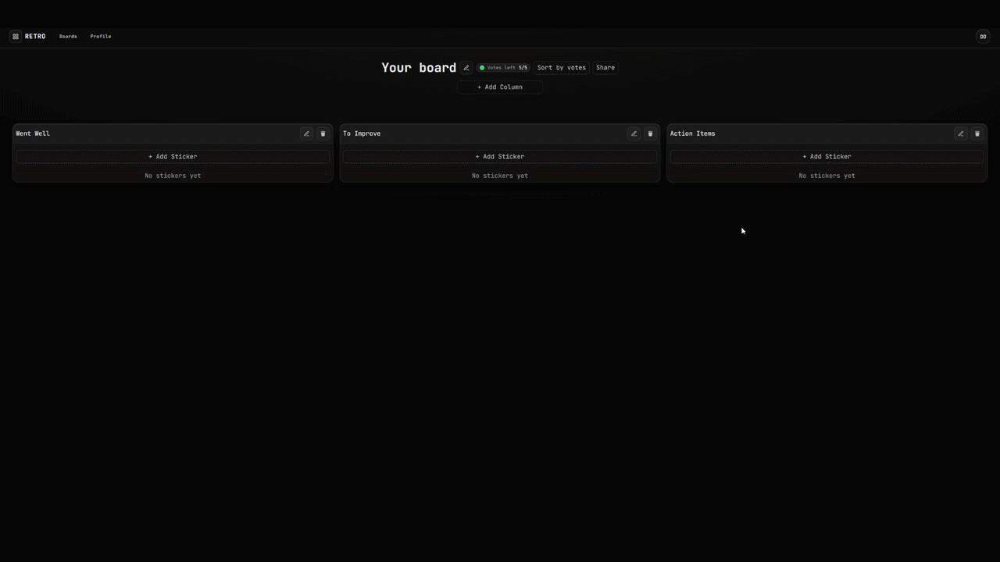

# Retropad

A board for Agile retrospectives. Participants add stickers to columns, vote with dots, and see each
other's changes live.

Live: https://retropad.dkhomutov.dev



## Stack

- Frontend: Next.js 16 (App Router), React 19, TypeScript, TanStack Query, dnd-kit, socket.io-client,
  Feature-Sliced Design
- Backend: NestJS 11, TypeScript (strict), Prisma 7, PostgreSQL 16, Passport JWT, socket.io,
  class-validator
- Tests: Jest unit tests and API end-to-end tests on a real PostgreSQL for the backend, run in CI.
  Playwright end-to-end tests against the full stack, desktop and mobile viewports
- Infrastructure: Docker Compose, nginx, Cloudflare, GitHub Actions, GHCR, a single VPS

```
browser ──▶ Cloudflare ──▶ nginx ─┬─▶ Next.js   (retropad.dkhomutov.dev)
                                  └─▶ NestJS    (api-retropad.dkhomutov.dev) ──▶ PostgreSQL
                                        ▲
                         HTTP + socket.io
```

## Features

- Boards with columns and stickers. Columns are reordered by drag-and-drop.
- Board members with roles. The owner manages the board, its columns and its members. An editor adds
  stickers and can change only their own. A viewer can read and vote.
- Dot-voting: five dots per person per board, and several can go on one sticker. The server returns
  only totals, so nobody can see who voted for what. Stickers can be sorted by votes; this does not
  change their saved order.
- Changes made by one participant show up for everyone else on the board without a reload.
- The board list, the board and the members panel show loading and error states. The layout works on
  a phone.

## How it works

### Live updates

All reads and writes go over HTTP. After a write, the server sends `board:changed {boardId}` over
socket.io to everyone in that board's room, and their clients refetch the board. The socket carries no
data, so there are no per-entity events to keep in sync. A client that loses the connection refetches
when it reconnects and catches up. The client that made the change is left out of the broadcast
because it already has the new data from its own HTTP response.

### Vote budget under concurrent requests

Before adding a dot, the server checks how many the user has already spent on the board. If two
requests arrive at the same time with four dots spent, both could pass the check and the user would
end up with six. To prevent this, the vote runs in a `Serializable` transaction. PostgreSQL aborts one
of two conflicting transactions, and the service retries it after a short random delay. If it keeps
failing, the client gets `409`.

### Authorization

All board permission checks are in `BoardAccessService`: `assertCanView`, `assertCanEdit`,
`assertCanManage` and `assertCanTouchSticker`. Each returns the user's role, which the API includes in
board responses so the client knows which controls to show. The WebSocket gateway uses the same
service: joining a board's room requires view access.

### Transactions

Moving a sticker or a column shifts its neighbours and updates the moved item in one transaction.
A new board is created together with its three default columns in one nested write. Removing a member
also deletes their votes on that board, in the same transaction.

### Authentication

Access and refresh tokens are stored in httpOnly cookies. The access token is short-lived, and the
refresh token is replaced on every refresh. Passwords are hashed with bcrypt. Login returns the same
error for an unknown email and a wrong password. Register, login and refresh are rate-limited. The
WebSocket connection is authenticated with the same cookie before it is accepted.

### Deployment

On every push, GitHub Actions typechecks, lints and builds both apps. A push to `master` also builds
Docker images, pushes them to GHCR and deploys them to the server over SSH. The SSH key used for this
can run only the deploy script. nginx takes the visitor's real IP from Cloudflare's header, so rate
limits count each visitor separately. The database is backed up daily, old backups are rotated out,
and restoring from a backup has been tested.

## Running locally

Requirements: Node.js 20+, Docker.

```bash
# 1. PostgreSQL
cp .env.example .env
docker compose up -d

# 2. API on :3000
cd backend
cp .env.example .env            # fill in the JWT secrets
npm install
npx prisma migrate dev
npx prisma generate
npm run start:dev

# 3. Web app on :3001
cd ../frontend
npm install
npm run dev
```

Backend tests. The e2e suite needs PostgreSQL and uses its own `<name>_test` database.

```bash
cd backend
npm test
npm run test:e2e
```

The frontend end-to-end tests need PostgreSQL and the API running. Playwright starts the web app itself.

```bash
cd frontend
npx playwright install chromium
npm run test:e2e
```

## Project layout

```
backend/     NestJS API. Modules: auth, boards, columns, stickers, members, board-access,
             votes, realtime. Prisma schema and migrations.
frontend/    Next.js app, organized by FSD layers: app, page, widgets, features, entities,
             shared. Playwright tests in e2e/.
nginx/       Reverse proxy and TLS configuration.
scripts/     Deploy and database backup scripts.
```
